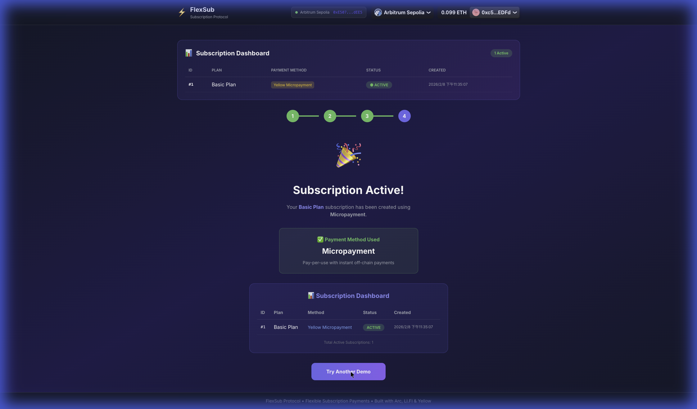

# FlexSub SDK

⚡ **Cross-chain Subscription SDK for Web3**

> Add flexible subscription payments to any dApp with one SDK.  
> Users pay from any chain. Merchants receive USDC.

---

## 📦 What is FlexSub SDK?

**FlexSub SDK** is a TypeScript library that enables developers to integrate subscription payments into their Web3 applications. It abstracts away the complexity of cross-chain transactions, micropayments, and stablecoin settlements.

```typescript
import { FlexSub, YellowIntegration, LiFiIntegration, ArcIntegration } from '@flexsub/sdk';

// Initialize with your preferred payment method
const flexsub = new FlexSub({
  arc: new ArcIntegration({ usdcAddress, contractAddress }),
  lifi: new LiFiIntegration({ targetChain: 'arbitrum' }),
  yellow: new YellowIntegration({ clearNodeUrl: 'wss://clearnet.yellow.com/ws' })
});

// Create a subscription
await flexsub.subscribe({ planId: 1, paymentMethod: 'arc' });
```

---

## 💡 Why FlexSub?

### The Problem

- **Chain Fragmentation**: Users have assets on multiple chains
- **Gas Fee Overhead**: Every payment incurs gas fees
- **Stablecoin Friction**: Merchants want USDC, users hold various tokens

### Our Solution

| Feature | How |
|---------|-----|
| **Pay from Anywhere** | LI.FI bridges any token → USDC |
| **Instant & Gas-less** | Yellow Network state channels |
| **Stable Settlement** | Circle USDC on-chain |

---

## 🎬 Demo



*Subscription Dashboard showing active subscription via Yellow Micropayment*

👉 [Try Live Demo](https://flexsub.vercel.app/unified-demo)

---

## 🛠️ SDK Modules

### `@flexsub/sdk/arc` - USDC Settlement
```typescript
import { ArcIntegration } from '@flexsub/sdk';

const arc = new ArcIntegration({
  usdcAddress: '0x75faf114eafb1BDbe2F0316DF893fd58CE46AA4d',
  contractAddress: '0xE5074CBbd046AFb491EB8692abD6cF7ECCC6dEE5'
});

await arc.approveUSDC(amount);
await arc.subscribe(planId);
```

### `@flexsub/sdk/lifi` - Cross-Chain
```typescript
import { LiFiIntegration } from '@flexsub/sdk';

const lifi = new LiFiIntegration({ integrator: 'your-app' });

const quote = await lifi.getQuote({
  fromChain: 137,        // Polygon
  toChain: 42161,        // Arbitrum
  fromToken: 'MATIC',
  toToken: 'USDC',
  amount: '10'
});
```

### `@flexsub/sdk/yellow` - Micropayments
```typescript
import { YellowIntegration } from '@flexsub/sdk';

const yellow = new YellowIntegration({
  clearNodeUrl: 'wss://clearnet-sandbox.yellow.com/ws'
});

await yellow.connect();
await yellow.openChannel(depositAmount);
await yellow.sendPayment(0.001); // Instant, no gas!
await yellow.closeChannel();
```

---

## 📁 Project Structure

```
flexsub/
├── sdk/              ← 🌟 Core SDK
│   ├── src/arc.ts       # USDC settlement
│   ├── src/lifi.ts      # Cross-chain bridge
│   └── src/yellow.ts    # Micropayments
│
├── contracts/        ← Smart Contracts
│   └── src/FlexSubManager.sol
│
└── demo/             ← Demo Website
```

---

## 🚀 Quick Start

```bash
# Install SDK
pnpm add @flexsub/sdk

# Or clone the repo
git clone https://github.com/UranusLin/flexsub.git
cd flexsub
pnpm install
pnpm build
```

---

## 🔗 Deployment

| Network | Contract | Address |
|---------|----------|---------|
| Arbitrum Sepolia | FlexSubManager | `0xE5074CBbd046AFb491EB8692abD6cF7ECCC6dEE5` |
| Arbitrum Sepolia | USDC (Circle) | `0x75faf114eafb1BDbe2F0316DF893fd58CE46AA4d` |

---

## 📄 License

MIT
