# FlexSub Architecture

## System Overview

## Payment Flow Details

### 1. Direct USDC Payment (Arc)

### 2. Cross-Chain Payment (LI.FI)

```mermaid
sequenceDiagram
    participant U as User
    participant W as Wallet
    participant SDK as FlexSub SDK
    participant LiFi as LI.FI API
    participant Bridge as Bridge/DEX
    participant FS as FlexSubManager

    U->>W: Select Plan (from any chain)
    W->>SDK: Initiate Cross-Chain
    SDK->>LiFi: getQuote(srcChain, destChain)
    LiFi-->>SDK: Quote + Route
    SDK->>W: Sign Transaction
    W->>Bridge: Execute Swap+Bridge
    Bridge->>FS: subscribe(planId) [destination chain]
    FS-->>SDK: subscriptionId
    SDK-->>U: ✅ Subscription Active
```

### 3. Micropayment (Yellow Network)

## Smart Contract Architecture

## Tech Stack

| Layer | Technology |
|-------|------------|
| Frontend | Next.js 14, React, RainbowKit |
| SDK | TypeScript, Viem, Wagmi |
| Smart Contracts | Solidity, Foundry |
| Protocols | Arc/USDC, LI.FI, Yellow Network |
| Testing | Anvil (local), Foundry Tests |

## Deployment Targets

| Network | Status | Contract Address |
|---------|--------|------------------|
| Anvil Local | ✅ Deployed | `0xe7f1725E7734CE288F8367e1Bb143E90bb3F0512` |
| Polygon Mumbai | 🔄 Pending | - |
| Arbitrum Sepolia | 🔄 Pending | - |
